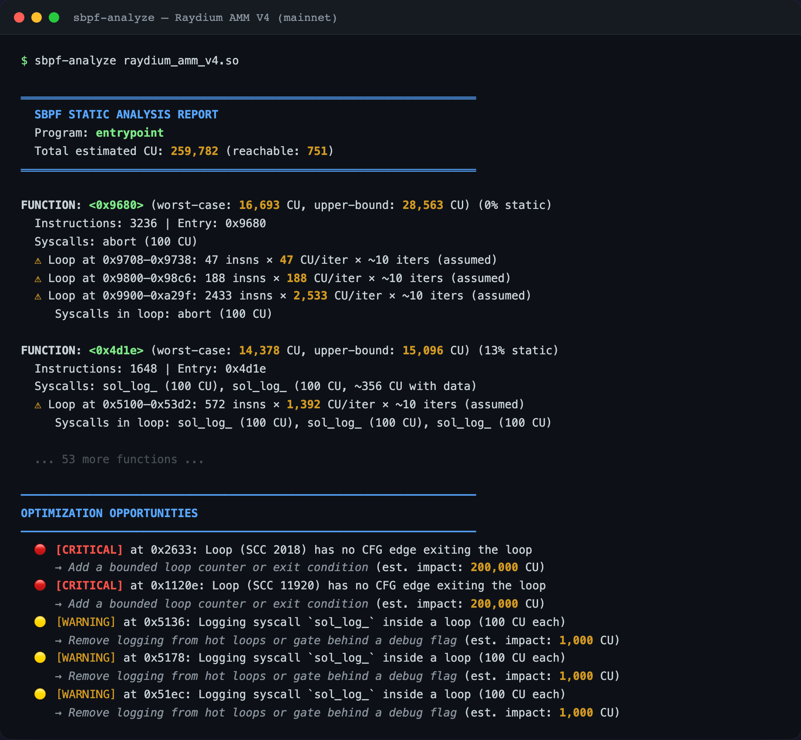
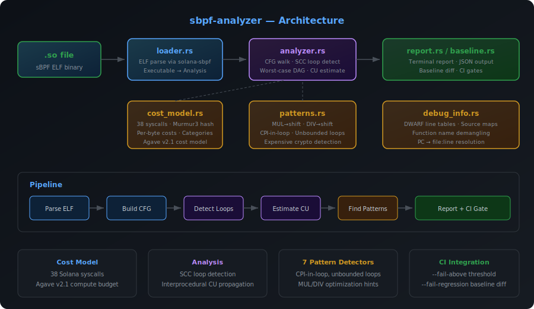

# sbpf-analyzer

Static compute unit analyzer for Solana sBPF programs. Feed it a compiled `.so` file, get back a ranked report of which functions burn the most CUs, where the loops are, and what to optimize — before you deploy.

<p align="center">
  
</p>

## Why

Solana programs have a hard **1.4M compute unit (CU) cap per transaction**. Exceed it and the transaction fails — but unlike Ethereum, the user **still pays fees** for the failed transaction. A simple token transfer costs ~3,000 CU (trivial), but a complex DeFi operation — a liquidation iterating over 8 collateral positions, a multi-hop swap across 4 AMMs — can approach the limit fast. Every serious protocol team manually audits for CU efficiency. There is no open-source static analysis tooling for this.

`sbpf-analyzer` is the tool that should exist but doesn't.

## The Problem: How CU Debugging Works Today

```
Write code → cargo build-sbf → Deploy to devnet → Run transactions → Check logs
                                                          ↓
                                              "Transaction failed: exceeded CU limit"
                                                          ↓
                                              Guess which function is expensive
                                                          ↓
                                    Add sol_log_compute_units_() calls everywhere
                                                          ↓
                                              Redeploy → Rerun → Read logs → Repeat
```

Today, finding CU problems requires **deploying and running transactions** first. There is no way to see compute costs from the compiled binary alone. Developers sprinkle `sol_log_compute_units_()` calls through their code, redeploy, rerun, and read logs — repeating for every function they suspect. There is no CI automation, no diffing between versions, no way to catch regressions before mainnet.

## With sbpf-analyzer

```
Write code → cargo build-sbf → sbpf-analyze program.so → See the full report instantly
                                          ↓
                            "Function X: 30K CU, 18 loops, logging in loop"
                                          ↓
                            Fix it → Rebuild → Re-analyze → Confirm the improvement
```

| What you need to do | Before | After |
|---|---|---|
| **Find expensive functions** | Deploy → run → read logs → guess | One command, ranked report in seconds |
| **Find loops burning CU** | Read source manually | Automatic detection with iteration bounds |
| **Find wasted logging** | Nobody checks | Flagged automatically |
| **Catch CU regressions** | Not possible until production | `--fail-regression` in CI on every PR |
| **Onboard a new dev** | "Ask the senior dev which functions are hot" | Run the tool, read the report |
| **Pre-audit prep** | Auditors start from scratch | Hand them the JSON report |

A CU investigation that currently takes **2–4 hours** of deploy-test-guess cycles becomes a **10-second command**. CI regression detection — which currently doesn't exist at all — prevents CU blowups from reaching mainnet.

## Install

```bash
cargo install --path .
```

Or build from source:

```bash
git clone https://github.com/illegalcall/sbpf-analyzer.git
cd sbpf-analyzer
cargo build --release
# Binary at ./target/release/sbpf-analyze
```

## Quick Start

### Analyze a local `.so` file

```bash
# Analyze a compiled Solana program
sbpf-analyze target/deploy/my_program.so

# JSON output (for CI/tooling)
sbpf-analyze target/deploy/my_program.so --json
```

### Analyze a deployed mainnet program

```bash
# Dump any deployed program from mainnet
solana program dump -u m TokenkegQfeZyiNwAJbNbGKPFXCWuBvf9Ss623VQ5DA spl_token.so

# Analyze it
sbpf-analyze spl_token.so
```

### CI integration

```bash
# Fail CI if any function exceeds 200K CU
sbpf-analyze target/deploy/my_program.so --fail-above 200000

# Fail CI if CU regresses more than 5% from baseline
sbpf-analyze target/deploy/my_program.so --baseline baseline.json --fail-regression 5.0

# Save a baseline for future comparisons
sbpf-analyze target/deploy/my_program.so --save-baseline baseline.json
```

## What It Detects

### Compute Unit Estimation

| Metric | Description |
|---|---|
| **Worst-case CU** | Longest single execution path through the function's CFG |
| **Upper-bound CU** | Sum of all basic blocks (every path taken) |
| **Interprocedural CU** | Worst-case including all callee functions |
| **Confidence %** | How much of the estimate is based on static facts vs assumptions |
| **Reachable CU** | Only functions reachable from the entrypoint |

### Pattern Detection (7 detectors)

| Pattern | Severity | Description |
|---|---|---|
| Unbounded Loop | Critical | SCC with no exit edge — potential full-budget drain |
| CPI in Loop | Critical | `sol_invoke_signed` inside a loop — 1,000+ CU per iteration |
| Expensive Syscall in Loop | Critical | Syscall with >1,000 CU base cost inside a loop |
| Logging in Loop | Warning | `sol_log_` in a hot loop — 100 CU per call adds up |
| Expensive Crypto Op | Warning | `sol_secp256k1_recover` (25K CU), elliptic curve ops, etc. |
| Indirect Call | Warning | `CALL_REG` — CU cost cannot be resolved statically |
| MUL/DIV by Power of Two | Info | Can be replaced with shift instructions |

### Loop Analysis

- **SCC-based detection** via Tarjan's algorithm (from `solana-sbpf`)
- **Static bound extraction** for canonical counted loops (`for i in 0..N`)
- **Worst-case single-iteration path** via condensed DAG longest-path
- **Configurable default iterations** for unbounded loops (`--loop-iterations N`)

## Architecture

<p align="center">
  
</p>

```
.so file → ELF parse (solana-sbpf) → CFG + SCC analysis → CU estimation → Pattern detection → Report
```

| Module | Role |
|---|---|
| `loader.rs` | ELF loading, syscall stub registration, `Executable` → `Analysis` |
| `analyzer.rs` | CFG walk, SCC loop detection, worst-case DAG, interprocedural CU |
| `cost_model.rs` | 38 Solana syscalls with Murmur3 hash lookup, per-byte costs |
| `patterns.rs` | 7 pattern detectors with severity classification |
| `report.rs` | Colored terminal output + JSON report generation |
| `baseline.rs` | Save/load/diff baselines for regression detection |
| `debug_info.rs` | DWARF parsing for source-level PC → file:line mapping |

## Demo: Real Mainnet Programs

We ran sbpf-analyzer against 10 of the most-used Solana programs, dumped directly from mainnet with `solana program dump`:

| Program | Size | Functions | Loops | Total CU | Critical | Logging in Loops |
|---|---|---|---|---|---|---|
| Memo V2 | 73 KB | 237 | 50 | 47,083 | 2 | 1 |
| SPL Token | 131 KB | 165 | 52 | 56,720 | 1 | 0 |
| SPL Token-2022 | 1.3 MB | 559 | 189 | 144,317 | 1 | 2 |
| Serum DEX V3 | 483 KB | 188 | 80 | 212,576 | 1 | 2 |
| Metaplex Token Metadata | 776 KB | 1,283 | 173 | 191,884 | 5 | 1 |
| Raydium AMM V4 | 1.3 MB | 419 | 171 | 259,782 | 2 | 3 |
| Jupiter V6 | 2.8 MB | 1,083 | 206 | 300,974 | 1 | 0 |
| Drift V2 | 6.4 MB | 3,073 | 1,278 | 2,752,652 | 3 | 47 |
| Orca Whirlpool | 10 MB | 919 | 321 | 546,465 | 0 | 0 |
| Kamino Lending | 10 MB | 1,265 | 386 | 1,248,664 | 2 | 87 |

**Across 10 programs**: 9,191 functions, 2,906 loops, 18 critical findings, 134 logging-in-loop instances.

Notable results:
- **Kamino Lending** has 87 `sol_log_` calls inside loops — at 100 CU each, a multi-collateral path could burn 5,000–10,000 CU on logging alone
- **Drift V2** has 47 logging-in-loop instances and the highest loop count (1,278) of any program
- **Orca Whirlpool** is the only program with zero critical findings and zero logging in loops
- **Serum DEX V3** has the single hottest function at ~41,000 CU worst-case with 51 syscalls

### Example: Raydium AMM V4

```
$ solana program dump -u m 675kPX9MHTjS2zt1qfr1NYHuzeLXfQM9H24wFSUt1Mp8 raydium.so
$ sbpf-analyze raydium.so

OPTIMIZATION OPPORTUNITIES
  🔴 [CRITICAL] Loop (SCC 2018) has no CFG edge exiting the loop — potentially unbounded
     → Add a bounded loop counter or exit condition (est. impact: 200,000 CU)
  🔴 [CRITICAL] Loop (SCC 11920) has no CFG edge exiting the loop — potentially unbounded
     → Add a bounded loop counter or exit condition (est. impact: 200,000 CU)
  🟡 [WARNING]  sol_log_ inside a loop (100 CU each)
     → Remove logging from hot loops or gate behind a debug flag
```

## GitHub Actions

```yaml
name: CU Analysis
on: [push, pull_request]

jobs:
  analyze:
    runs-on: ubuntu-latest
    steps:
      - uses: actions/checkout@v4
      - uses: dtolnay/rust-toolchain@stable

      - name: Install sbpf-analyzer
        run: cargo install --path tools/sbpf-analyzer  # or from git

      - name: Build program
        run: anchor build  # or cargo build-sbf

      - name: Analyze CU usage
        run: |
          sbpf-analyze target/deploy/my_program.so \
            --json \
            --fail-above 500000 \
            --save-baseline cu-baseline.json

      - name: Check for regressions
        if: github.event_name == 'pull_request'
        run: |
          # Download baseline from main branch
          git show origin/main:cu-baseline.json > prev-baseline.json 2>/dev/null || true
          if [ -f prev-baseline.json ]; then
            sbpf-analyze target/deploy/my_program.so \
              --baseline prev-baseline.json \
              --fail-regression 10.0
          fi
```

## CLI Reference

```
sbpf-analyze [OPTIONS] <PATH>

Arguments:
  <PATH>  Path to the .so file to analyze

Options:
  --json                     Output as JSON instead of colored terminal report
  --baseline <FILE>          Compare against a previous baseline JSON file
  --save-baseline <FILE>     Save current analysis as a baseline
  --loop-iterations <N>      Default loop iteration assumption [default: 10]
  --fail-above <CU>          Exit code 1 if any function exceeds this CU threshold
  --fail-regression <PCT>    Exit code 1 if regression exceeds this percentage
  -h, --help                 Print help
```

## Cost Model

Based on **Agave v2.1** compute budget. Key syscall costs:

| Syscall | Base CU | Per-Byte | Category |
|---|---|---|---|
| `sol_secp256k1_recover` | 25,000 | — | Crypto |
| `sol_alt_bn128_group_op` | 10,000 | — | Crypto |
| `sol_big_mod_exp` | 10,000 | — | Crypto |
| `sol_poseidon` | 3,000 | — | Crypto |
| `sol_curve_group_op` | 2,208 | — | Crypto |
| `sol_create_program_address` | 1,500 | — | PDA |
| `sol_try_find_program_address` | 1,500 | — | PDA |
| `sol_invoke_signed_rust` | 1,000 | — | CPI |
| `sol_log_` | 100 | 1 CU/byte | Logging |
| `sol_sha256` | 85 | 1 CU/byte | Crypto |
| `sol_memcpy_` | 10 | — | Memory |

Each sBPF instruction costs 1 CU. Cost differentiation comes from syscalls and loop iteration counts.

## Limitations

- **Stripped binaries**: Mainnet programs have no symbol names. Functions are identified by entry PC only. Build with debug info for better output.
- **Loop bounds**: Only canonical `for i in 0..N` patterns are statically extracted. Complex loops fall back to the default assumption (10 iterations).
- **CPI targets**: The target program of a CPI call lives in account data at runtime — it cannot be resolved statically.
- **No execution**: This is pure static analysis. It cannot detect data-dependent behavior or runtime-only paths.

## License

Apache-2.0
